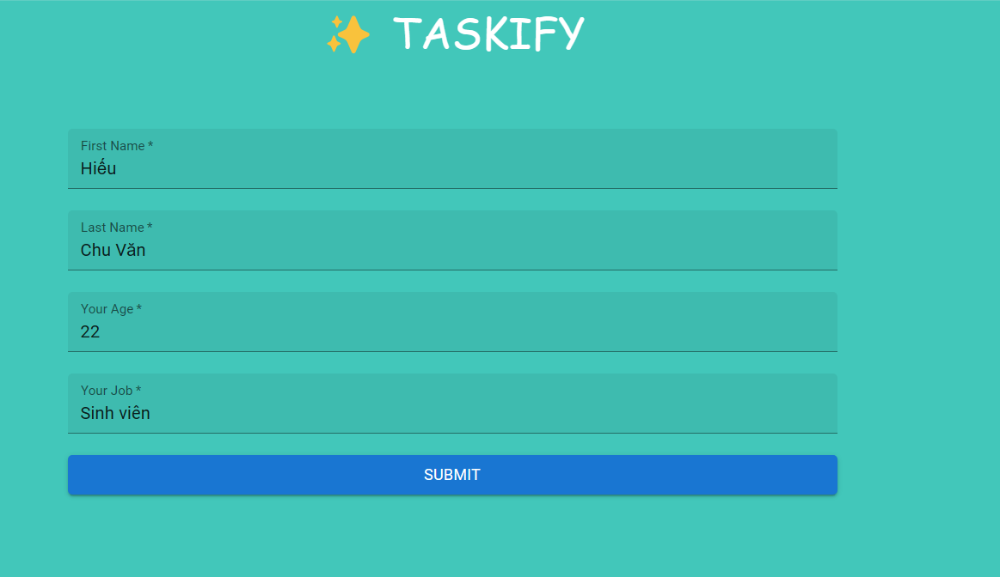
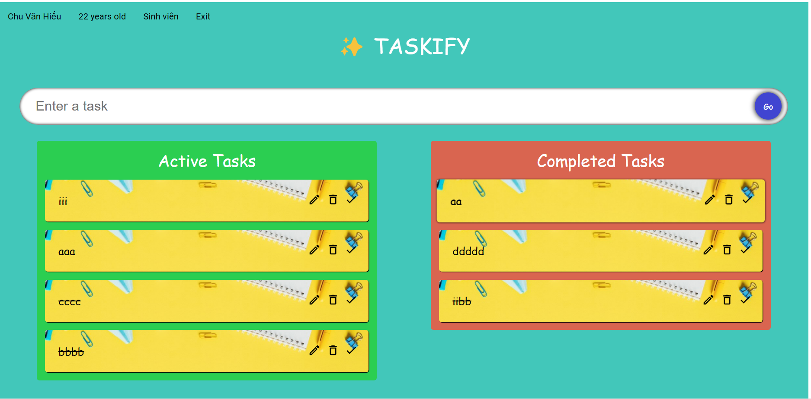
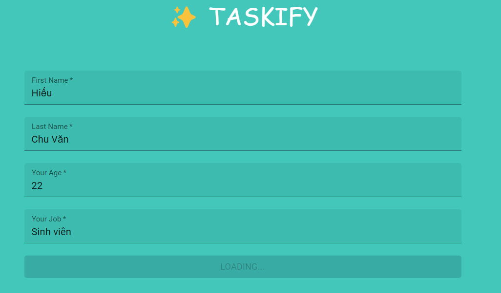
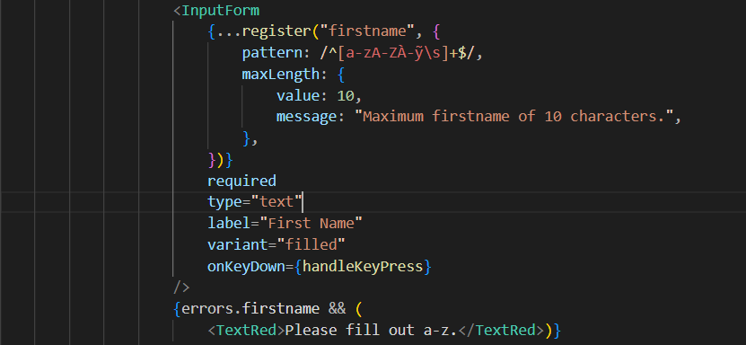

Phần mở rộng:
+ 
+ thêm các component dùng react-hook-form: form home.
+ form home có các trường dùng để lưu thông tin người dùng.
    firstname: string;
    lastname: string;
    age: number;
    job: string;
+ dùng redux lưu dữ liệu người dùng vào store.
+ store vẫn dùng localstore để lưu dữ liệu trên trình duyệt.
+ dùng react-router-dom để chuyển trang với useNavigate và routes.
+ 
+ thêm thông tin người dùng và nút Exit để quay lại home bằng useNavigate.
+ react-hook-form dùng     
const { 
    register, đăng ký 1 input với react-hook-form.
    handleSubmit, sự kiện submit.
    setValue, đặt giá trị mặc định.
    formState: {errors, isSubmitting} xử lý lỗi và 
        đặt điều kiện cho sự kiện qua isSubmitting kiểu boolean.
} = useForm<InformationForm>();
+ 
+ 
+ thêm các điều kiện cho các trường để xử lý lỗi.
+ đặt các sự kiện enter nhập trường tiếp theo, settimeout thêm thời gian xử lý,...
+ sử dụng MUI cho các icon, container,...
+ viết css theo styled-component.
